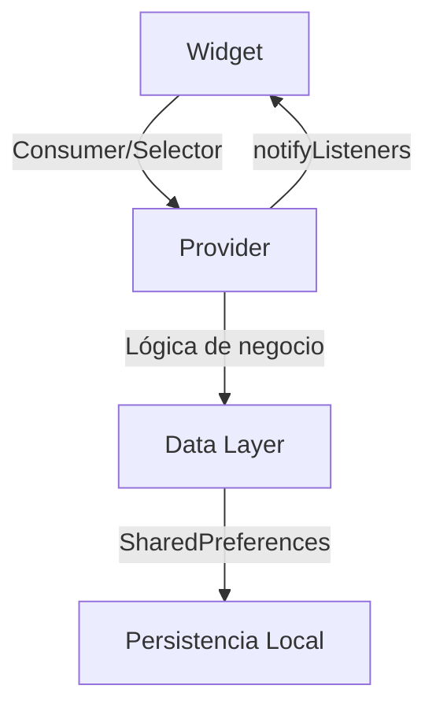

# Arquitectura del Proyecto TimerRubik

Este documento describe la arquitectura y organización del código de TimerRubik.

## 🏗️ Patrón de Arquitectura

El proyecto utiliza una arquitectura basada en **Provider** para la gestión de estado, siguiendo los principios de separación de responsabilidades y modularidad.

### Capas principales

```
┌─────────────────────────────────────┐
│           Presentation Layer        │
│  (Screens, Views, Widgets)         │
├─────────────────────────────────────┤
│        Business Logic Layer        │
│         (Providers)                │
├─────────────────────────────────────┤
│           Data Layer               │
│     (SharedPreferences)            │
└─────────────────────────────────────┘
```

## 📁 Estructura detallada

### `/lib/main.dart`
Punto de entrada de la aplicación. Configura:
- MultiProvider para inyección de dependencias
- Configuración de tema y navegación
- Inicialización de proveedores globales

### `/lib/providers/`
**Capa de lógica de negocio**
- `times_providers.dart`: Gestiona los tiempos de solución
- `scramble_providers.dart`: Maneja la generación y almacenamiento de scrambles

### `/lib/screens/`
**Pantallas principales de la aplicación**
- `onboarding_screen.dart`: Pantalla principal con navegación por tabs
- `algorithms_screen.dart`: Pantalla dedicada a algoritmos
- `list_views.dart`: Vista de listas y navegación
- `rubik_timer.dart`: Pantalla del temporizador (duplicado, se recomienda refactorizar)

### `/lib/views/`
**Componentes de vista específicos**
- `rubik_timer.dart`: Lógica del temporizador
- `records.dart`: Visualización de registros
- `algorithms_oll.dart`: Algoritmos OLL
- `algorithms_pll.dart`: Algoritmos PLL
- `scramble.dart`: Generador de scrambles
- `side_menu.dart`: Menú lateral de navegación

### `/lib/widgets/`
**Componentes reutilizables**
- `custom_app_bar.dart`: Barra de aplicación personalizada

## 🔄 Flujo de Datos

### Gestión de Estado con Provider



### TimesProvider
```dart
class TimesProvider with ChangeNotifier {
  final List<Map<String, dynamic>> _times = [];
  
  void addTime(double time) {
    _times.add({'time': time.toStringAsFixed(2)});
    notifyListeners(); // Notifica cambios a los widgets
  }
}
```

### ScrambleProvider
Gestiona la generación y almacenamiento de scrambles para cada intento de solución.

## 🎯 Principios de Diseño

### 1. Separación de Responsabilidades
- **Providers**: Lógica de negocio y estado
- **Views**: Presentación y UI
- **Widgets**: Componentes reutilizables

### 2. Inyección de Dependencias
```dart
MultiProvider(
  providers: [
    ChangeNotifierProvider(create: (_) => TimesProvider()),
    ChangeNotifierProvider(create: (_) => ScrambleProvider())
  ],
  child: MaterialApp(...)
)
```

### 3. Reactividad
Los widgets se reconstruyen automáticamente cuando el estado cambia mediante `notifyListeners()`.

## 🔧 Consideraciones Técnicas

### Estado Local vs Global
- **Global**: Tiempos, scrambles (persisten entre pantallas)
- **Local**: Estados de UI específicos (animaciones, formularios)

### Persistencia de Datos
Utiliza `SharedPreferences` para almacenamiento local:
- Tiempos de solución
- Preferencias de usuario
- Historial de scrambles

### Navegación
- `PageView` con `BottomNavigationBar` para navegación principal
- `Drawer` para funciones adicionales

## 🚀 Recomendaciones de Mejora

### 1. Refactorización
- Eliminar duplicación en `rubik_timer.dart` (screens vs views)
- Crear un repositorio para abstracción de datos
- Implementar patrón Repository para datos

### 2. Testing
- Unit tests para providers
- Widget tests para componentes
- Integration tests para flujos principales

### 3. Escalabilidad
- Considerar `Riverpod` para gestión de estado más robusta
- Implementar `Freezed` para clases de datos inmutables
- Agregar validación de datos con `FormZ` o similar

### 4. Performance
- Implementar lazy loading para algoritmos
- Optimizar reconstrucciones con `Selector`
- Cachear imágenes de algoritmos

## 📝 Convenciones de Código

### Nomenclatura
- Archivos: `snake_case`
- Clases: `PascalCase`
- Variables/Métodos: `camelCase`
- Constantes: `SCREAMING_SNAKE_CASE`

### Organización
- Un archivo por widget/clase principal
- Imports agrupados: Flutter → Third party → Local
- Métodos privados con prefijo `_`